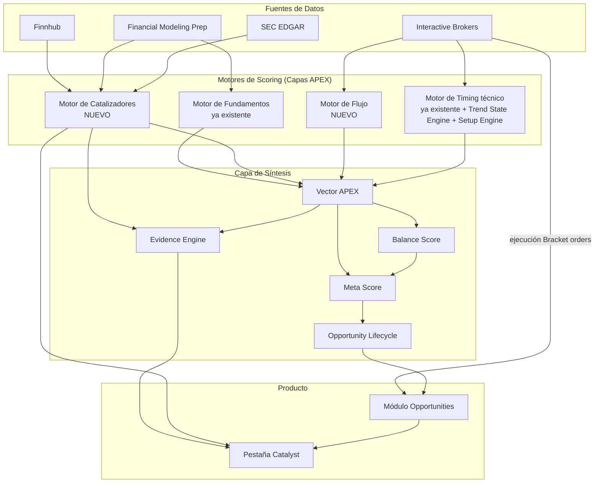

# Blueprint APEX / EQTA — Implementación Grupo V1

**Proyecto:** eTrader Quantitative Trading Architecture (EQTA) — APEX v5.2 → v6.0 (evolución V1)
**Documento:** Especificación de implementación para desarrollo agéntico (Antigravity)
**Tipo:** Spec-Driven Development — este documento es la fuente única de verdad (SSOT) para el agente
**Alcance:** Grupo V1 completo (V1.1 → V1.4)

---

## 0. Cómo usar este documento con Antigravity

Este blueprint está pensado para pegarse como especificación de proyecto (System Specification) en Antigravity. Sugerencia de flujo:

1. Crear un nuevo Project en Antigravity apuntando a la carpeta del repo de EQTA.
2. Pegar la Sección 6 (especificación técnica por componente) como contexto de cada tarea, o guardarla como regla de workspace (`.agents/rules/apex-model.md`) para que persista entre sesiones.
3. Usar la Sección 7 (plan de fases) como lista de tareas para el Manager Surface — una tarea/agente por sub-fase, en el orden indicado (hay dependencias entre fases).
4. Usar la Sección 8 (criterios de aceptación) como Test Specification para que el agente valide su propio trabajo antes de reportar la fase como completa.

---

## 1. Resumen ejecutivo

APEX es el motor de scoring cuantitativo de EQTA, construido sobre 4 capas (Fundamentos, Catalizadores, Flujo, Timing técnico). El sistema ya tiene un modelo funcionando en producción para la capa de Fundamentos y Timing técnico, con ejecución vía Interactive Brokers (IBKR). Este blueprint define cómo evolucionar ese modelo incorporando:

- Una nueva estructura de datos (**Vector APEX**) que reemplaza el score único por un vector multidimensional.
- Un **Motor de Catalizadores** real, alimentado por Finnhub, FMP y SEC EDGAR (ya con API keys generadas).
- Variables de **Flujo** institucional usando los datos de mercado que ya provee IBKR.
- Un **Trend State Engine (T0–T5)** y un **Setup Engine** de patrones técnicos que refinan el motor de Timing existente.
- Capas de síntesis: **Balance Score**, **Meta Score**, **Evidence Engine**, **Opportunity Lifecycle**.
- Una nueva pestaña **"Catalyst"** dentro del módulo Opportunities.

Se descarta Polygon.io por costo (sin plan gratuito) y se difiere Charles Schwab a V2/V3 (fricción operativa del refresh token de 7 días, no aporta catalizadores/flujo).

---

## 2. Lo que YA TENEMOS funcionando (baseline — no se reconstruye, se extiende)

| Componente | Estado | Detalle |
|---|---|---|
| **Motor de Fundamentos (APEX Quality Score)** | ✅ Funcionando | EPS growth, Revenue growth, PEG, P/E, P/S, ROE, ROIC, márgenes, FCF, FCF growth, Debt/Equity |
| **Motor de Timing técnico** | ✅ Funcionando | EMA20/50/200, RSI, MACD, ATR, ADX, Bandas de Bollinger, soportes/resistencias, breakouts |
| **Broker / Ejecución** | ✅ En consolidación | Interactive Brokers (IBKR) — streaming de datos + órdenes tipo Bracket. Se profundiza en V1.1, no se reemplaza. |
| **Fuentes de datos con acceso activo** | ✅ API keys generadas | Finnhub (free tier, 60 req/min), Financial Modeling Prep (free tier, 250 req/día) |
| **Setup Engine (patrones)** | ⚠️ Diseñado, no implementado | Bull Flag, Cup&Handle, Flat Base, VCP, Ascending Triangle, Darvas Box — están en el diseño arquitectónico pero pendientes de código |
| **Decisión de bróker** | ✅ Resuelta | IBKR confirmado como único bróker para V1. Schwab diferido. |

**Regla para el agente:** ningún componente de esta tabla se reescribe desde cero. El trabajo de V1 es *envolver, extender y conectar* estos motores existentes a las nuevas capas descritas abajo — no reemplazarlos.

---

## 3. Lo NUEVO a incorporar en V1

| # | Componente nuevo | Depende de | Categoría |
|---|---|---|---|
| 1 | **Vector APEX** (estructura de datos multidimensional) | Nada — es la base | Fundamentos |
| 2 | **Integración Finnhub** (catalizadores, noticias, fundamentales) | API key (✅ ya está) | Catalizadores / Fundamentos |
| 3 | **Integración FMP** (fundamentales adicionales, analyst estimates) | API key (✅ ya está) | Fundamentos / Catalizadores |
| 4 | **Integración SEC EDGAR** (filings 8-K: M&A, cambios de dirección) | Ninguna (público, gratis) | Catalizadores |
| 5 | **Motor de Catalizadores** | #2, #3, #4 | Catalizadores |
| 6 | **Variables de Flujo vía IBKR** (RVOL, distancia VWAP, volumen institucional aproximado, block trades) | Conexión IBKR consolidada | Flujo |
| 7 | **Trend State Engine (T0–T5)** | Motor de Timing existente | Timing técnico |
| 8 | **Setup Engine** (patrones técnicos) | Motor de Timing existente | Timing técnico |
| 9 | **Balance Score** | #1 (Vector APEX poblado) | Síntesis |
| 10 | **Meta Score** | #5, #6, #7, #8, #9 | Síntesis |
| 11 | **Evidence Engine** | #1, #5 | Síntesis / Transparencia |
| 12 | **Opportunity Lifecycle** (máquina de estados) | Ninguna — se puede implementar en paralelo | Síntesis / Producto |
| 13 | **Pestaña "Catalyst" en Opportunities** | #5, #11 | Producto / UI |

**Explícitamente fuera de alcance en V1** (quedan para V2/V3, no tocar en esta fase): Confianza Engine, EOV con probabilidades reales, Market Regime Engine, Market Memory, Sector Rotation Engine, Bayesian Decision Engine, Capital Allocation Engine, Dark Pool, Options Flow, integración Charles Schwab.

---

## 4. Modelo final — cómo queda el sistema tras V1



**Lectura del modelo final:**
- Las 4 fuentes de datos alimentan los 4 motores de capa (2 ya existentes extendidos, 2 completamente nuevos).
- Todos los motores de capa escriben al **Vector APEX**, que es el registro central de cada oportunidad.
- Balance Score y Meta Score son cálculos derivados del Vector APEX — no capturan datos nuevos, solo sintetizan.
- Evidence Engine lee del Vector APEX y del Motor de Catalizadores para generar explicaciones legibles.
- Opportunity Lifecycle gobierna el estado de cada oportunidad y decide cuándo se activa la ejecución vía IBKR.
- La pestaña Catalyst es la superficie visible de todo esto en el módulo Opportunities.

---

## 5. Fuentes de datos — especificación de acceso

| Fuente | Auth | Límite | Uso principal |
|---|---|---|---|
| Finnhub | `token` query param o header `X-Finnhub-Token` | 60 req/min | Catalizadores (earnings, news, insider sentiment), fundamentales básicos |
| FMP | API key en query param | 250 req/día | Fundamentales (ratios, key-metrics), analyst estimates |
| SEC EDGAR | Header `User-Agent: <nombre> <email>` (sin key) | Uso razonable, sin límite duro publicado | Catalizadores regulatorios (8-K) |
| IBKR | Sesión TWS/Gateway + suscripción de market data | Según suscripción de bolsa | Flujo, Timing, ejecución |

**Regla para el agente:** implementar un rate limiter explícito por fuente desde el primer commit (especialmente FMP con solo 250/día). Implementar caché local (ej. no repetir `calendar/earnings` del mismo día). Nunca hardcodear las API keys — usar variables de entorno (`FINNHUB_API_KEY`, `FMP_API_KEY`).

---

## 6. Especificación técnica por componente

### 6.1 Vector APEX

Reemplaza el score único actual por un objeto estructurado por oportunidad/ticker:

```json
{
  "ticker": "string",
  "timestamp": "ISO8601",
  "fundamentals_score": "number (0-100)",
  "catalyst_score": "number (0-100)",
  "flow_score": "number (0-100)",
  "timing_score": "number (0-100)",
  "trend_state": "T0 | T1 | T2 | T3 | T4 | T5",
  "setup_pattern": "string | null",
  "balance_score": "number (calculado)",
  "meta_score": "number (calculado)",
  "lifecycle_state": "string (ver 6.6)",
  "evidence": "array de strings (ver 6.5)"
}
```

### 6.2 Motor de Catalizadores

Consume Finnhub + FMP + SEC EDGAR y produce `catalyst_score` + lista de eventos detectados. Tipos de catalizador a cubrir en V1 (los que las fuentes gratuitas permiten):

- Earnings calendar / earnings surprise (Finnhub)
- Revisiones de analistas / estimates (FMP)
- Insider sentiment (Finnhub)
- Noticias relevantes por ticker (Finnhub)
- Buybacks (FMP/Finnhub, cuando esté disponible en el free tier)
- Eventos materiales / M&A / cambios de dirección vía filings 8-K (SEC EDGAR)

Cada evento detectado debe guardar: tipo, fecha, fuente, y un peso de impacto (definir escala simple 1-3 en V1, sin necesidad de calibración estadística todavía — eso es V2 con Confidence Engine).

### 6.3 Motor de Flujo (vía IBKR)

Variables a calcular con los datos que ya provee IBKR:

- RVOL (volumen relativo vs. promedio histórico)
- Distancia al VWAP
- Aproximación de volumen institucional / block trades vía time & sales
- Fuerza relativa vs. SPY

Dark pool y options flow quedan explícitamente fuera (no hay fuente gratuita confiable — V2/V3).

### 6.4 Trend State Engine (T0–T5) y Setup Engine

- **Trend State Engine:** clasificación de 6 estados de tendencia (T0 a T5) construida sobre los indicadores ya existentes (EMA20/50/200, ADX, estructura de máximos/mínimos). Es un refinamiento del motor de Timing actual, no un motor nuevo desde cero.
- **Setup Engine:** detección de los patrones ya diseñados (Bull Flag, Cup&Handle, Flat Base, VCP, Ascending Triangle, Darvas Box) sobre los mismos datos de precio/volumen de IBKR.

### 6.5 Balance Score, Meta Score y Evidence Engine

- **Balance Score:** mide qué tan pareja es una oportunidad entre las 4 capas del Vector APEX (ej. desviación estándar entre `fundamentals_score`, `catalyst_score`, `flow_score`, `timing_score` — menor dispersión = mejor balance). Fórmula exacta a definir por el agente en fase de implementación, documentando el criterio elegido.
- **Meta Score:** ponderación de `fundamentals_score + catalyst_score + flow_score + timing_score + balance_score`. Los pesos iniciales deben quedar como constantes configurables (no hardcodeadas inline), para poder recalibrarlas sin tocar lógica.
- **Evidence Engine:** motor basado en reglas (if/then simples) que traduce los datos del Vector APEX y del Motor de Catalizadores en frases legibles para el usuario (ej. "PEG < 1: infravalorada respecto a su crecimiento", "Earnings en 3 días con historial de sorpresas positivas"). Sin ML en V1 — reglas explícitas y auditable.

### 6.6 Opportunity Lifecycle

Máquina de estados mínima para V1:

```
DESCUBIERTA → EN_OBSERVACION → SETUP_DETECTADO → TRIGGER_ACTIVO → EJECUTADA → CERRADA
                                                              ↘ DESCARTADA
```

Cada transición debe quedar registrada con timestamp y la razón (referenciando el Evidence Engine cuando aplique).

### 6.7 Pestaña "Catalyst" en Opportunities

Requisitos mínimos de UI para V1:
- Mostrar `catalyst_score` de forma prominente por oportunidad.
- Listar los eventos detectados por el Motor de Catalizadores (tipo, fecha, fuente).
- Mostrar las frases del Evidence Engine relacionadas con catalizadores.
- No requiere gráficos avanzados en V1 — prioridad es exponer los datos ya calculados, no crear visualizaciones nuevas.

---

## 7. Plan de fases (orden de ejecución para Antigravity)

### V1.1 — Fundación de datos
- [ ] Configurar rate limiter y caché para Finnhub y FMP
- [ ] Configurar cliente SEC EDGAR con `User-Agent` correcto
- [ ] Confirmar y consolidar conexión IBKR (streaming + suscripción de market data activa)
- [ ] Diseñar e implementar el esquema del Vector APEX (base de datos o estructura de archivos, a definir según stack del repo)
- [ ] Definir capa de persistencia/orquestación (frecuencia de actualización por fuente)

### V1.2 — Motores de scoring
- [ ] Implementar Motor de Catalizadores (consume Finnhub + FMP + SEC EDGAR → `catalyst_score` + eventos)
- [ ] Implementar Motor de Flujo sobre datos de IBKR → `flow_score`
- [ ] Implementar Trend State Engine (T0–T5) sobre el motor de Timing existente
- [ ] Implementar Setup Engine (6 patrones definidos)

### V1.3 — Síntesis y transparencia
- [ ] Implementar Balance Score
- [ ] Implementar Meta Score (pesos configurables)
- [ ] Implementar Evidence Engine (reglas explícitas)
- [ ] Implementar Opportunity Lifecycle (máquina de estados con historial)

### V1.4 — Producto
- [ ] Implementar pestaña Catalyst dentro de Opportunities
- [ ] Conectar Evidence Engine + Motor de Catalizadores a la UI

**Dependencias críticas:** V1.2 no puede empezar sin que V1.1 tenga el Vector APEX definido. V1.3 no puede empezar sin que V1.2 esté produciendo datos reales (no placeholders). V1.4 depende de que V1.3 tenga Evidence Engine funcionando.

---

## 8. Criterios de aceptación por fase (Test Specification)

| Fase | Criterio de aceptación |
|---|---|
| V1.1 | Se puede hacer una llamada real a Finnhub, FMP y SEC EDGAR y recibir datos sin exceder límites; el Vector APEX se puede instanciar y poblar parcialmente con datos reales de al menos un ticker de prueba |
| V1.2 | Para un ticker de prueba con evento conocido (ej. earnings próximos), el Motor de Catalizadores detecta el evento correctamente; el Motor de Flujo produce un RVOL coherente con los datos de IBKR; el Trend State Engine asigna un estado T0-T5 verificable manualmente; el Setup Engine detecta al menos un patrón en un gráfico de prueba conocido |
| V1.3 | El Balance Score y Meta Score se calculan sin errores para un Vector APEX completo; el Evidence Engine genera al menos 2 frases coherentes por oportunidad; el Opportunity Lifecycle transiciona correctamente entre estados con un caso de prueba simulado |
| V1.4 | La pestaña Catalyst muestra datos reales (no mock) de una oportunidad procesada end-to-end por todo el pipeline |

---

## 9. Reglas generales para el agente

1. **No romper lo que ya funciona.** El Motor de Fundamentos, el Motor de Timing existente y la conexión IBKR son baseline — se extienden, no se reescriben.
2. **Configuración externa, no hardcodeada.** API keys, pesos del Meta Score, y umbrales de indicadores deben vivir en configuración (env vars / archivo de config), nunca inline.
3. **Presupuesto de llamadas.** Respetar 60 req/min (Finnhub) y 250 req/día (FMP) con manejo explícito de errores 429.
4. **Sin ML en V1.** Evidence Engine y Motor de Catalizadores usan reglas explícitas, no modelos entrenados — eso es V2/V3 (Confidence Engine, Bayesian Decision Engine).
5. **Documentar decisiones de diseño no especificadas aquí** (ej. fórmula exacta del Balance Score, stack de persistencia) directamente en el código o en un ADR, ya que este blueprint deja esos detalles abiertos a criterio de implementación.
6. **No incorporar Charles Schwab ni Polygon.io** en esta fase bajo ninguna circunstancia — quedan fuera de alcance por decisión explícita.
